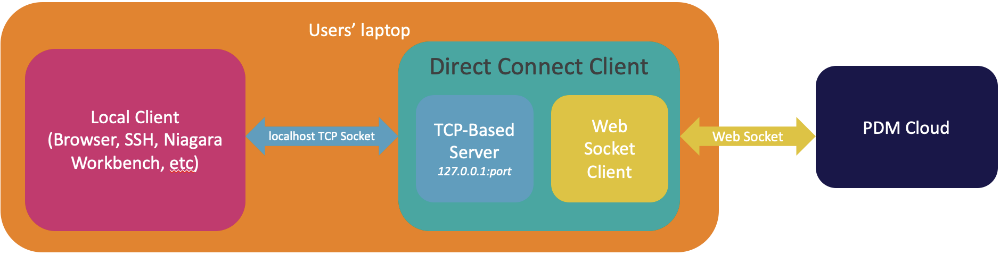

# Pelion Direct Connect Client 

Pelion Direct Connect Client acts as a local TCP server that accepts local TCP connections and establishes corresponding websocket connections to the Pelion Edge tunneling service through a TCP connection on the Pelion cloud.

### Overview


This diagram shows Pelion Direct Connect Client has a local TCP server ready to accept any TCP-based connection locally. Pelion Direct Connect Client establishes the websocket connection to the exposed websocket API on Pelion Device Management's cloud per TCP-based connection and proxies the bytes back and forth between the local TCP connections and cloud websocket connections.

### Websocket API

Swagger documentation for the exposed websocket API is available [here](docs/api.yml)

### Configuration of parameters

| Parameter | Type   | Description           | Example |
| -------------------- | ------ | --------------------- | ------- | 
| listen-uri | string | Local address that pelion-direct-connect-client is listening on (please note that this is not related to the container service that is listening on the device) | localhost:8181 |
| cloud-uri | string | The exposed websocket API on the PDM cloud that is ready for connections from pelion-direct-connect-client. Check the last step for how to use this API | wss://{PDM_CLOUD_API_ADDRESS}/v3/devices/{DEVICE_ID}/services/127.0.0.1:80/connection |
| api-key | string | Access key that is generated from the Pelion Portal | ak_********* |

### Example use:

1. Deploy a TCP-based container service to the gateway. 

1. [Install Go](https://golang.org/doc/install).

1. Build the client by running:

   ```
   $ go build
   ```

1. Launch pelion-direct-connect-client locally by providing parameters - `listen-uri`, `cloud-uri` and `api-key`:

   ```
   $ ./pelion-direct-connect-client -listen-uri=<LOCAL_ADDRESS> -cloud-uri=<CLOUD_URI> -api-key=<API_KEY>
   ```

1. Open a browser by pointing to the address with the above `listen-uri`.

<span class="notes">**Note:** The browser is one of the example local clients and the choice of local client depends on the container service deployed on the gateway.</span>
