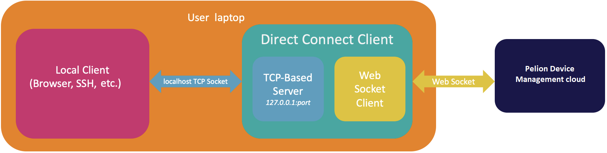

# pelion-direct-connect-client 
pelion-direct-connect-client serves as a local tcp server that accepts local tcp connection and establish corresponding websocket connection to edge tunneling service per tcp connection to the PDM Cloud

### Overview

The above diagram shows pelion-direct-connect-client has a local tcp server that is ready for accepting any tcp-based connection locally. It establishes the websocket connection to the exposed websocket API on PDM Cloud per tcp-based connection and proxies the bytes back and forth between the local tcp connections and cloud websocket connections.

### Websocket API
Swagger documentation for the exposed websocket API is available [here](docs/api.yml)

### Configuration of parameters
| Parameter | Type   | Description           | Example |
| -------------------- | ------ | --------------------- | ------- | 
| listen-uri | string | Local address that pelion-direct-connect-client is listening on (please note that this is not related to the container service that is listening on the device) | localhost:8181 |
| cloud-uri | string | The exposed websocket API on the PDM cloud that is ready for connections from pelion-direct-connect-client. Check the last step for how to use this API | wss://{PDM_CLOUD_API_ADDRESS}/v3/devices/{DEVICE_ID}/services/127.0.0.1:80/connection |
| api-key | string | Access key that is generated from the Pelion Portal | ak_********* |

### Example Use:

* Deploy a tcp-based container service to the gateway 

* Install Go. See the [instructions](https://golang.org/doc/install) here and build the client by running:
> `$ go build`

* Launch pelion-direct-connect-client locally by providing parameters - `listen-uri`, `cloud-uri` and `api-key`
> `$ ./pelion-direct-connect-client -listen-uri=<LOCAL_ADDRESS> -cloud-uri=<CLOUD_URI> -api-key=<API_KEY>`

* Open a browser by pointing the address with the above `listen-uri`
(please note that browser is one of the example local clients and the choose of local client is depending on the container service that is deployed on the gateway)
